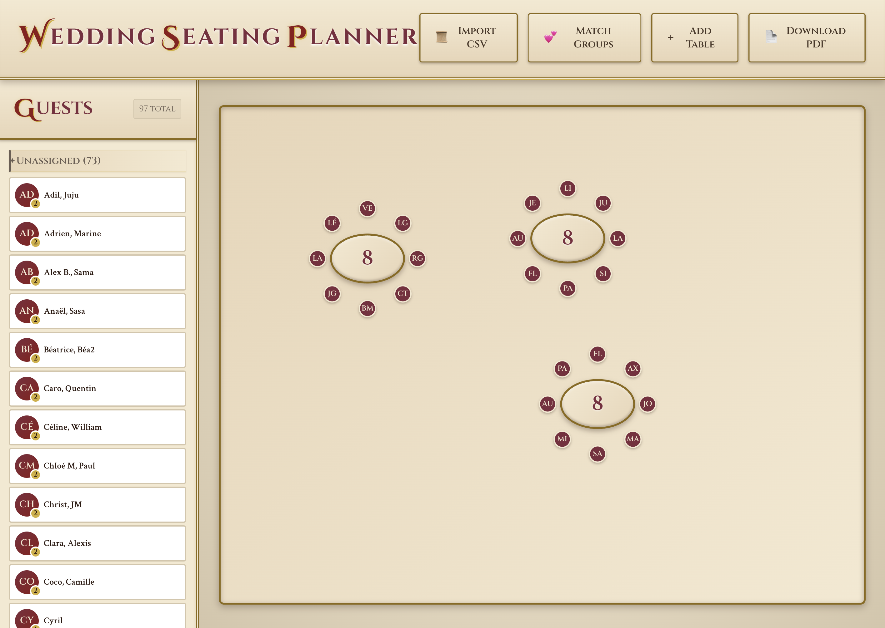

# WedPlan

A beautiful, interactive wedding seating planner with AI-powered optimization. Drag-and-drop table management, guest group constraints, and a CP-SAT solver to find the perfect seating arrangement.



## Features

### Interactive Seating Canvas
- **Drag & Drop Tables** — Add circular tables and arrange them freely on a parchment-style canvas
- **Adjustable Capacity** — Click a selected table to edit seat count (2–20 seats)
- **Visual Guest Display** — Guest initials appear around tables in a circular layout
- **PDF Export** — Download your final seating plan as a high-quality PDF

### Guest Management
- **CSV Import** — Bulk import guests from CSV files (each row = one group)
- **Group Highlighting** — Click any guest group to highlight them across the canvas
- **Assignment Tracking** — View unassigned guests and table occupancy at a glance
- **Persistent State** — Your work is automatically saved to localStorage

### Smart Matching System
- **Tinder-Style Matching** — Swipe through group pairs to set preferences
- **Like/Neutral/Dislike** — Express whether groups should sit together or apart
- **Keyboard Shortcuts** — Use arrow keys for quick matching (←/→/↑↓)

### AI-Powered Optimization
- **CP-SAT Solver** — Google OR-Tools constraint programming for optimal placement
- **Group Constraints** — Guests in the same CSV row always sit at the same table
- **Affinity Scoring** — Liked groups seated together, disliked groups kept apart
- **Real-Time Updates** — Automatic re-optimization when tables/constraints change

## Tech Stack

### Frontend
- **Vue 3** — Composition API with TypeScript
- **Pinia** — State management with localStorage persistence
- **@vueuse/gesture** — Drag-and-drop interactions
- **html2canvas + jsPDF** — PDF generation
- **PapaP Parse** — CSV parsing

### Backend
- **Python 3.12+**
- **FastAPI** — Modern async web framework
- **Pydantic v2** — Strict-mode data validation
- **OR-Tools CP-SAT** — Constraint programming solver
- **uv** — Fast Python package manager

## Getting Started

### Prerequisites
- Python 3.12 or higher
- Node.js 18+ (with npm or bun)
- [uv](https://docs.astral.sh/uv/) package manager

### Installation

```bash
# Clone the repository
git clone https://github.com/yourusername/wedplan.git
cd wedplan

# Install Python dependencies
uv sync

# Install frontend dependencies
bun install   # or npm install
```

## Running Locally

### 1. Start the Backend

```bash
uv run fastapi dev backend/wedplan/api/main.py
```

The API will be available at `http://localhost:8000`.

### 2. Start the Frontend

In a separate terminal:

```bash
# Point frontend to local backend
VITE_API_BASE=http://localhost:8000 bun dev

# Or with npm
VITE_API_BASE=http://localhost:8000 npm run dev
```

The app will open at `http://localhost:5173`.

### API Documentation

- Swagger UI: `http://localhost:8000/docs`
- ReDoc: `http://localhost:8000/redoc`

## Usage Guide

### 1. Import Your Guest List

Create a CSV file where each row represents a group that must sit together:

```csv
Alice Smith, Bob Smith
Charlie Brown, Diana Brown, Eddie Brown
Frank Green
Grace Lee, Henry Lee
```

- Each row = one group (family, couple, friends)
- Groups are automatically constrained to sit at the same table
- Single names are solo guests with flexible placement

Click **"Import CSV"** in the toolbar to load your guests.

### 2. Add Tables

Click **"Add Table"** to create tables. Each table defaults to 8 seats.

- **Drag** tables to position them on the canvas
- **Click** a table to select it
- **Click again** to edit the seat count (2–20)
- **Delete/Backspace** removes the selected table
- **Escape** deselects

### 3. Set Preferences (Optional)

Click **"Match Groups"** to open the matching interface:

- 👍 **Like** — Seat these groups at the same table or nearby
- 😐 **Neutral** — No preference (skip)
- 👎 **Dislike** — Keep these groups at different tables

Use arrow keys for speed: ← (dislike), ↑↓ (neutral), → (like)

### 4. Let AI Optimize

Optimization runs automatically when you:
- Add or remove tables
- Change table capacity
- Set group preferences

The solver finds the best arrangement that:
- Keeps groups together (CSV rows)
- Maximizes affinity between liked groups
- Separates disliked groups

### 5. Export Your Plan

Click **"Download PDF"** to save a printable version of your seating plan.

## API Endpoints

### Health Check

```bash
curl http://localhost:8000/health
```

### Optimize Seating

```bash
curl -X POST http://localhost:8000/v1/optimize \
  -H "Content-Type: application/json" \
  -d '{
    "tables": [
      {"id": "table1", "capacity": 8},
      {"id": "table2", "capacity": 8}
    ],
    "guests": [
      {"id": "g1", "name": "Alice"},
      {"id": "g2", "name": "Bob"}
    ],
    "groups": [
      {"id": "group1", "guest_ids": ["g1", "g2"]}
    ],
    "affinities": []
  }'
```

Response:
```json
{
  "status": "OPTIMAL",
  "objective_value": 100,
  "tables": [
    {
      "table_id": "table1",
      "seats": [
        {"seat_index": 0, "guest_id": "g1", "guest_name": "Alice"},
        {"seat_index": 1, "guest_id": "g2", "guest_name": "Bob"}
      ]
    }
  ],
  "solver_stats": {
    "conflicts": 0,
    "branches": 5,
    "wall_time_seconds": 0.012
  }
}
```

## Development

### Run Tests

```bash
uv run pytest
```

### Type Checking

```bash
# Backend
uv run mypy backend

# Frontend
bun run type-check  # or npm run type-check
```

### Linting

```bash
# Backend
uv run ruff check .
uv run ruff format .

# Frontend
bun run lint  # or npm run lint
```

### Build for Production

```bash
bun run build  # or npm run build
```

## Project Structure

```
wedplan/
├── src/                          # Vue frontend
│   ├── api/
│   │   └── optimize.ts           # Backend API client
│   ├── components/
│   │   ├── WeddingPlanner.vue    # Main app layout
│   │   ├── PlannerToolbar.vue    # Top action bar
│   │   ├── PlannerCanvas.vue     # Table canvas area
│   │   ├── DraggableTable.vue    # Interactive table component
│   │   ├── GuestList.vue         # Sidebar guest panel
│   │   ├── GroupMatcher.vue      # Tinder-style matching modal
│   │   └── SeatCountEditor.vue   # Inline seat editor
│   ├── composables/
│   │   └── useToast.ts           # Toast notification system
│   ├── stores/
│   │   └── tablePlanner.ts       # Pinia state management
│   ├── styles/
│   │   ├── medieval-theme.css    # Parchment theme styles
│   │   └── variables.css         # CSS custom properties
│   └── types/
│       └── index.ts              # TypeScript interfaces
│
├── backend/wedplan/              # Python backend
│   ├── api/                      # FastAPI application
│   │   ├── main.py               # App factory
│   │   ├── routes.py             # Router registration
│   │   └── v1/
│   │       ├── health.py         # Health endpoint
│   │       └── optimize.py       # Optimization endpoint
│   ├── core/
│   │   ├── config.py             # Settings
│   │   └── logging.py            # Logging setup
│   ├── domain/
│   │   ├── models.py             # Pydantic models
│   │   └── errors.py             # Exception types
│   └── solver/
│       ├── cp_sat.py             # Main solver
│       ├── mapping.py            # ID mappings
│       ├── constraints.py        # Constraint builders
│       ├── objective.py          # Objective function
│       └── extract.py            # Solution extraction
│
├── tests/                        # Python tests
├── package.json                  # Frontend dependencies
├── pyproject.toml                # Python project config
├── Dockerfile                    # Production container
└── README.md
```

## Constraint Model

The solver uses CP-SAT boolean variables:

- `x[g, t, s]`: Guest `g` sits at table `t` seat `s`
- `y[g, t]`: Guest `g` sits at table `t` (any seat)

### Constraints

1. **Assignment** — Each guest is assigned exactly one seat
2. **Capacity** — Each seat has at most one guest
3. **Same-Table** — Guests in the same group must share a table
4. **Affinity** — Liked groups get bonus points for sharing tables

### Objective

Maximize total affinity score:
- +1 for each liked group pair at the same table
- −1 penalty for each disliked group pair at the same table

## Keyboard Shortcuts

| Key | Action |
|-----|--------|
| `Delete` / `Backspace` | Remove selected table |
| `Escape` | Deselect table / Close modal |
| `←` | Dislike (in matcher) |
| `→` | Like (in matcher) |
| `↑` / `↓` | Neutral (in matcher) |

## License

MIT
